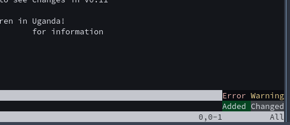
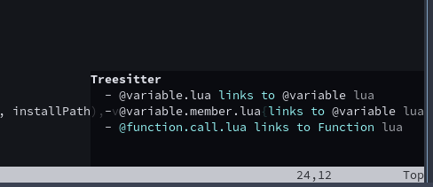

# mini-ui-messages-example
Playground for making use of Nvim UI messages redirection, especially with [mini-notify](https://github.com/echasnovski/mini.notify) ([modified for these needs](https://github.com/przepompownia/mini.notify/tree/ui-messages)). Requires Neovim at least on https://github.com/neovim/neovim/commit/9fa3a0964e9bf47932d350cdb53ef0364175a672

## start
- example with plugin: in particular it will install `mini.notify` in this project subdirectory
```sh
nvim -u init.lua init.lua
```
- minimal:
```sh
nvim -u minimal.lua init.lua
```

## examples with mini.notify
```lua
vim.api.nvim_echo({ {'Error ', 'ErrorMsg'}, {'Warning\n', 'WarningMsg'}, {'Added ', 'DiffAdd'}, {'Changed', 'DiffChange'} }, false, {})
```

```vim
:Inspect
```


## todo
### `ext_messages`
- search pattern (originally for bottom-left corner) shows in similar way as for `:=1` (event: `msg_show`, kind: `''`)
- probably fix lots other issues
